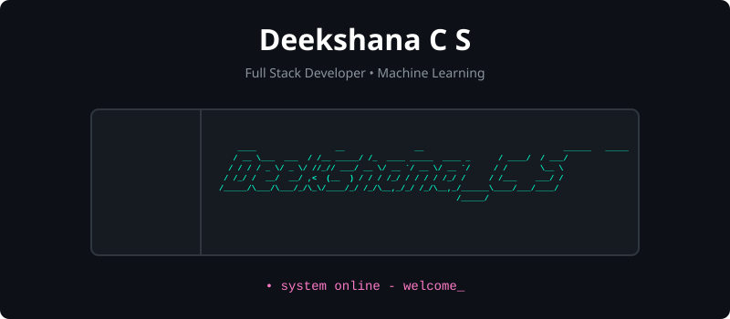

# Hi there, I'm Deekshana C S! 👋

  <!-- Dynamic Banner -->
  
  
    
  
  <!-- Typing Animation -->
  
  
   
  
  <!-- Social Badges -->
  
  
  

---

## 💫 About Me

I am a passionate developer, research scholar, and leader specializing in **Artificial Intelligence, Machine Learning, and Full-Stack Web Development**. I love bridging the gap between software engineering and physical systems, which has led me to explore exciting domains in **Robotics & IoT**, such as autonomous agricultural bots and assistive biomedical technologies. 

Beyond coding, I'm an active book reviewer, public speaker, and master of ceremonies, bringing energy and coordination to technical communities.

- 🎓 **Secretary** of **AEVA** (Artificial Intelligence and Machine Learning Empowered Visionary Alliance) at **K. S. Rangasamy College of Technology**.
- 🚀 Always building, exploring, and contributing to open-source software.
- 💡 Interested in using AI and deep learning to build tools that solve real-world problems.
- 🔍 Current Focus: Building SaaS applications powered by Large Language Models.

---

## 🛠️ My Tech Stack

### 💻 Programming Languages & Core

  

### 🧠 Artificial Intelligence & Machine Learning

  

### 🌐 Web Development & Frameworks

  

### 🛠️ Dev Tools & Services

  

---

## 🚀 Featured Projects

Here are some of the key projects I've built or am currently developing:

### 📄 **PaperPilot-AI** (AI-powered Research Paper Pilot SaaS)
An AI-powered SaaS application that helps researchers upload documents, query papers, extract summaries, and draft manuscripts seamlessly.
* **Stack:** FastAPI (Python backend), React/Next.js (Frontend), SQLite/PostgreSQL, LLM integration, Docker.

### 🤖 **Cholan** (Agro-based Bot)
An autonomous agricultural robot designed to assist farmers. It handles tasks like soil monitoring, weed detection, and smart watering.
* **Stack:** Python, IoT, OpenCV (computer vision), Arduino/Raspberry Pi.

### 🛡️ **SafeHer** (Lightweight Women's Safety Platform)
A lightweight women's safety platform built to provide quick assistance tools, emergency contacts, and real-time location sharing.
* **Stack:** HTML, CSS, JavaScript, Bootstrap.

### 🦾 **3D-Printed Prosthetic Hands**
A low-cost, functional prosthetic limb system combining biomedical engineering and 3D printing technology to make assistive devices accessible.
* **Stack:** 3D Design (CAD), Arduino, Bio-sensors.

---

## 📊 GitHub Analytics

  <table border="0">
    <tr>
      <td>
        
      </td>
      <td>
        
      </td>
    </tr>
  </table>
  
   
  
  

---

## 📈 Contribution Graph

  

---

## 💬 Get in Touch!

Let's connect, collaborate, or chat about AI/ML, web development, or robotics!

  

